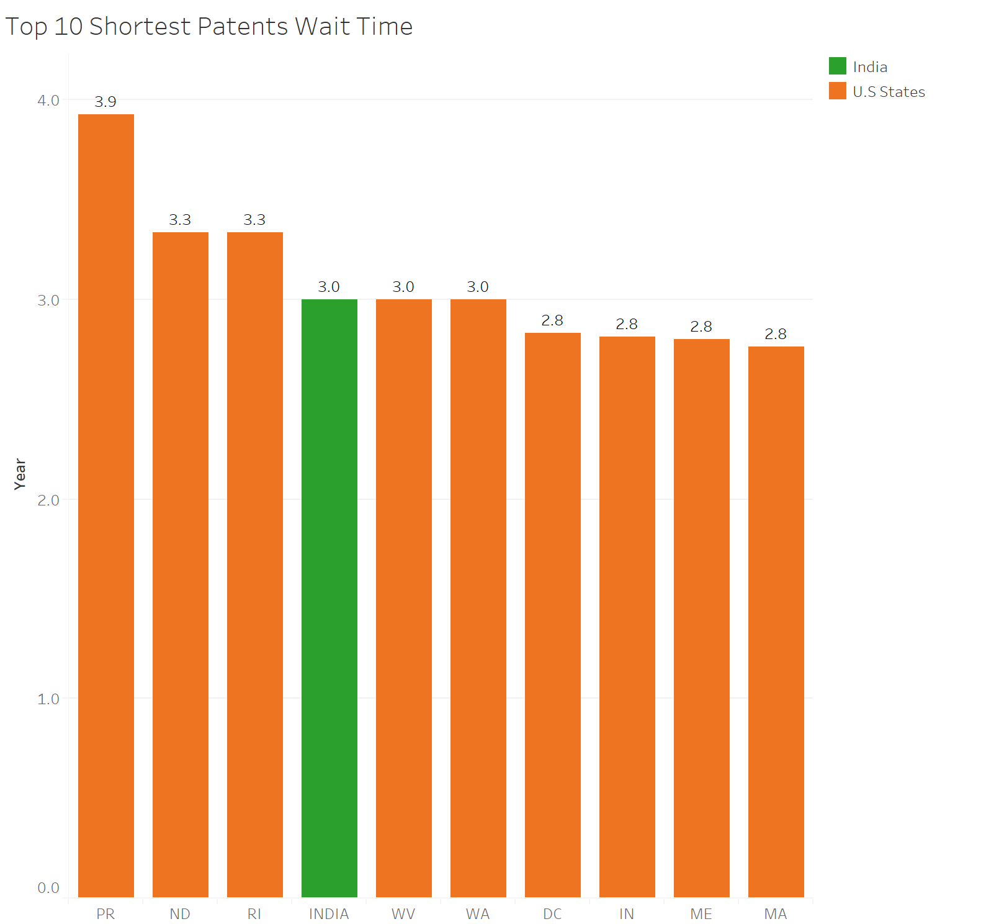
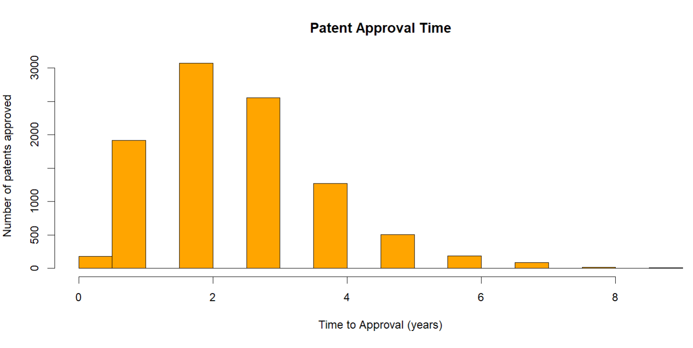
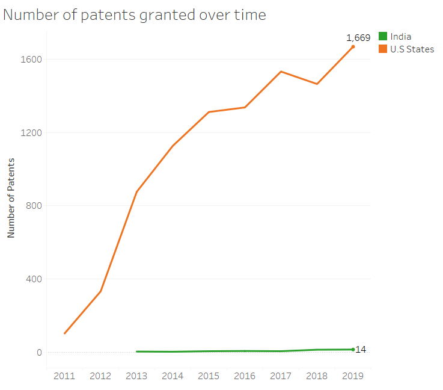
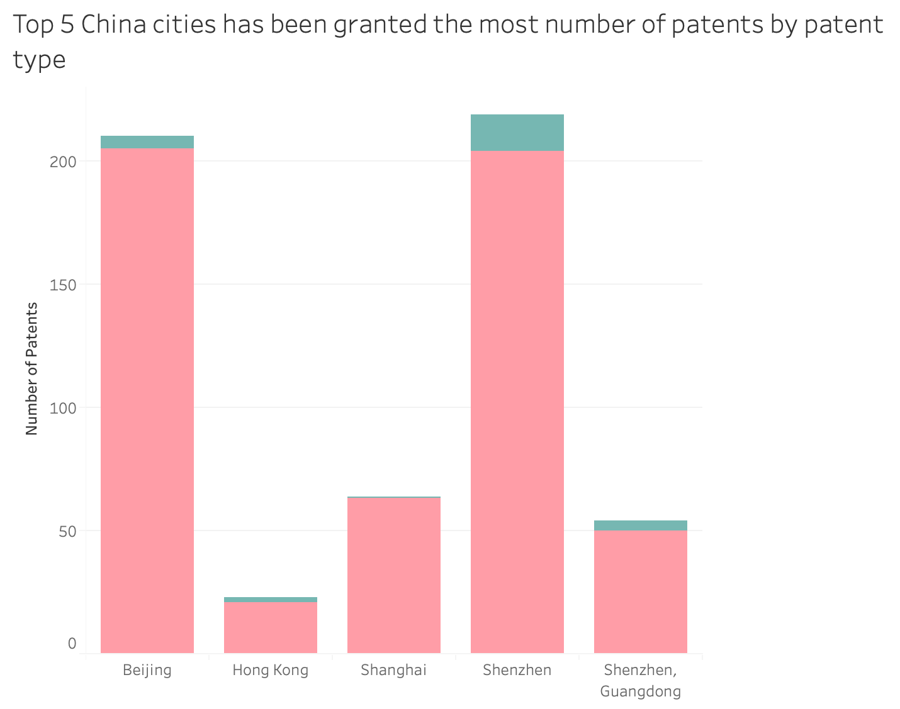
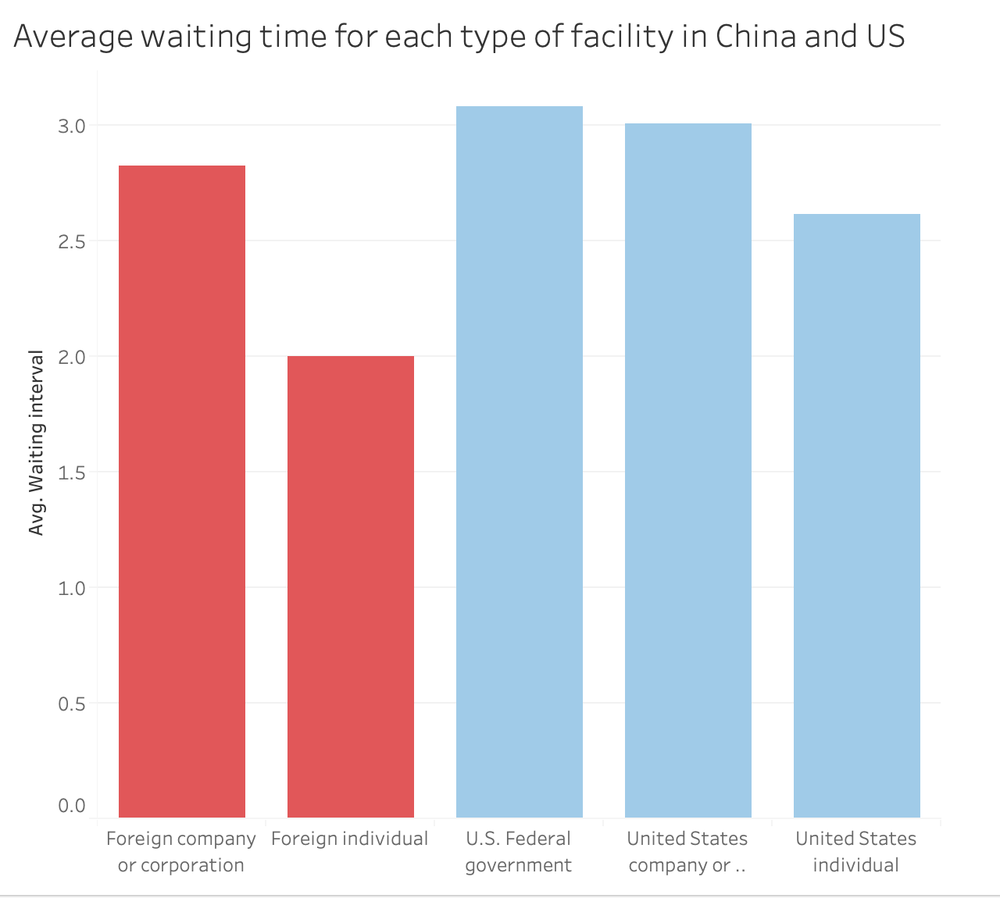

```{r setup, include=FALSE}
knitr::opts_chunk$set(echo = TRUE)

```

## Exploratory Data Analysis
```{r,  echo=FALSE}


```
<br />
The chart above shows the states with shortest waiting time 
to be approved. Massachusetts, Maine, Indiana and DC had the shortest waiting time. 
It took only 2.8 years for those states to be approved for their patents 
application. India was also among the top that had the shortest waiting interval,
which is 3 years. 
The interesting thing is that although California, NYC, and Texas had the most approved
patents, the waiting interval of these states was not among the shortest ones. 
```{r,  echo=FALSE}


```
<br />
Most patents are approved in 2 years. A lot of them are approved in 1 and 3 years as well.
```{r,  echo=FALSE}
knitr::include_graphics("2_top5states.png")

```
<br /><br />
California has significantly more patents compared to other states.

```{r,  echo=FALSE}


```
<br />
The number of patents granted in the U.S stably increased through years.
In the interval of 2017-2018, number of patents slightly decreased. However, after 2018,
the number of patents increased significantly.
In India, we can see that not many patents are granted every year. The total number of patents
approved to 2019 was only 14 patents. 

```{r,  echo=FALSE}


```
<br />
Top 5 cities that has been granted the most number of patents in China are: Beijing, Shenzhen, Shanghai and HongKong. The utility patent type is almost ten times higher that the design patent type. 
Beijng and Shenzhen are two cities that has the highest amoung of granted patents in China, which also makes sense due to the development of those 2 cities.

```{r,  echo=FALSE}


```
<br />
After the calculation of waiting time interval for both China and US companies. We could see there is a similar average time between US companies and foreign companies (here is China). In China, foreign company or corporation has the avg waiting time of 2.8 years, while the foreign individual has shorter time of 2 years only.

Similar situation happened to the US, US federal and US companies or corporations has the avg waiting time of 3 - 3.2 years, while individual waited shorter time of 2.6 years.