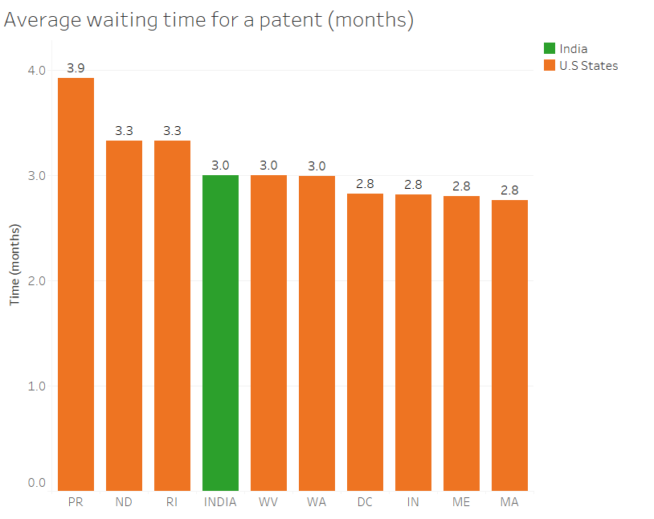
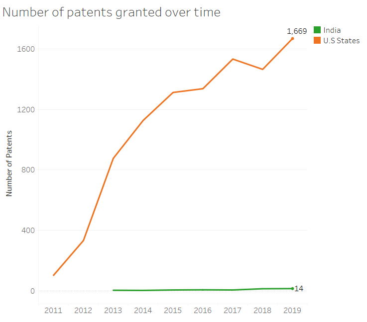

# Group 1 
```{r setup, include=FALSE}
knitr::opts_chunk$set(echo = TRUE)

```

## Exploratory Data Analysis

```{r,  echo=FALSE}


```

From the graph, we can see that India has an average waiting time of 3 months, being on the slower side of things, but not the slowest.

```{r,  echo=FALSE}
knitr::include_graphics("2_top5states.png")

```


```{r,  echo=FALSE}


```

We can see from the visualization that not many patents are granted in India every year, with only 14 submitted in 2019. Meanwhile, the US has been slowly rising in the number patents, growing up to 1,669 patents granted in 2019.